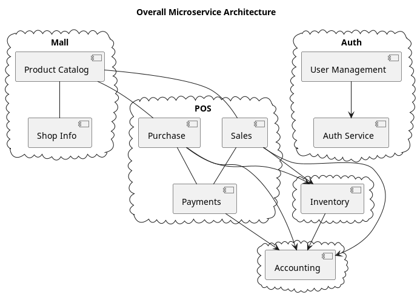

# XenaMall Documentation

## Why this documentation project is created
This is a product that occupies my mind during my free time. I want to allocate a couple of minutes/hours per day, and record my thoughts/ideas and free my mind during the rest of the day. The requirements and solutions described in this document will take turns and evolve over time. At some point, I will decide that I have enough clarity to get to the coding.

I could have gone the other way - start writing some code and let it evolve. I do like and enjoy that, but, going in that direction would make my solution hard to modify. When I have a lot of stuff coded in a way, I will be hesitant to move in the opposite direction. Anyway, there are certain work that have to be done regardless of the twists and turns of the solution. Creating master data would be a good example. Whenever I get bored documenting the system, I would engage in some coding to get me going. Otherwise, it would be too monotonous.

## Why this project
When I searched for Java based FOSS solutions for inventory and financial accounting, I came across several solutions that are
- Too big - ERP systems with hundreds for tables, with no proper documentation on how to get started
- Entity and persistence are not done using an ORM. They tend to go with XML based schema for entity creation with an underlying non-orm, custom code
- Too little - leave me with wanting many things

Instead, I wanted to create a product which is
- Based on microservices - makes it easy to understand and maintain. Does one single thing and does it well. Brings scalability benefits.
- Having a limited scope - ERP systems grew too big, and became too buggy. I want to limit my scope and make the product solid
- Based on a standard project structure and recent Spring Boot- Makes it easier for any developer to understand what is written
- Simple rather than being complex
- Choosing to prefer convention over configurability

## What is this project
- A POS with proper inventory, accounting, and web mall integration. Notice that I didn't say 'A proper Inventory and Accounting solution with a POS'. POS needs to be a first class citizen
- Multi-tenancy. The idea is that with a multi-tenant microservice system, adding a new client should only create very little overhead
- A small store owner with a cheap tab should be able to register as a tenant and should be able to run his business efficiently
- The below diagram shows the microservices I am currently considering the system will have
  
- Each microservice has its own requirement page for documentation

## Decisions to make
1. Will the POS live independent of the cloud data with an option to sync. Or are we going completely cloud.
2. A Federated system with multiple dbs for each workstation or not
3. Are we going to do everything on our own or create integrations with existing products?
