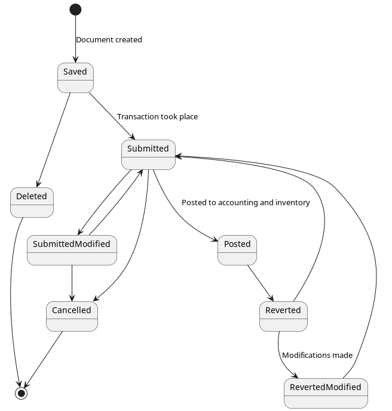

# POS - Requirements
## Overall
* POS is the client side terminal that produces the most essential source documents of the business, namely Sales Invoice/Returns, Payments Received/Returned, etc.
* These day-to-day operations are namely
  1. Entering purchase invoices/returns
  2. Entering sales invoices/returns
  3. Payments made and received
* It is possible to view some basic reports from the data entered in POS
* The POS system alone will satisfy the requirements of some customers whose needs are simple
* It is possible to sync pos entries with the cloud for additional reporting and functionality
* So, the POS should be an independent system which is extended by an online versatile accounting and inventory module
* It is possible to perform day-to-day operations with POS without requiring an active internet connection
*  1. This enables POS to operate as an independent system
   2. Even with cloud integrations, in situations where there is no Internet availability, it should be possible to issue source documents with POS and sync the details with the cloud once the connection is restored
* A single company can have many POS terminals
* Each POS terminal will have a unique name, and a unique series for its source documents 

## Login
* Unless integrated with the cloud, the system allows only a single root user
* Username and password of the root user is stored locally, and login is possible regardless of the integration of the cloud
* Root user has access to all POS features
* Root user does not have access to any cloud features
* Security for root user is very basic

## Features common to all source documents
* Following are considered as source documents
  - Purchase invoice
  - Sales invoice
  - Credit Note
  - Debit Note
  - Payment Receipt
  - Payment Voucher
  - Stock Reconciliation
  - Payment Reconciliation
* Below diagram shows the states of a source document
  
* Only the documents in Submitted or Posted states are included for pos reports
* Additional states and actions can be introduced through the state machine
* Once submitted, all changes to the source documents are tracked
* Submitted documents cannot be deleted permanently, but a soft deletion is allowed
* Source documents maintain auditability with created date, last modified date, created-by and last-modified-by
* Each pos will have a unique active series for source documents
* User can start a new series and mark it as active

## Purchase
* A purchase invoice captures the sales invoice of the supplier and any additional costs involved in that purchase
* Purchase invoice can't be in the future  
* Additional costs are used (the sum is distributed) to calculate the total cost of purchase
* Total cost is used to calculate the cost of each item in the purchase
* A purchase invoice can be linked with multiple payment entries
* Outstanding payment of an invoice can be viewed
* A purchase invoice can be associated with multiple purchase returns
* Purchase invoice can be entered for past and current dates
* Posting a purchase invoice sends the details to accounting and inventory modules
* See below for a wireframe //(TODO)

## Sales
* Sales invoices captures date/time, customer details, Serial, line items, discount, taxes, other charges, and sales person 
* A sales invoice captures the line items in a sale
* Line Items:
  * Each line item contains the item, unit, unit price, qty, price
  * Price is calculated as unit price * qty, but can be overridden in case of discounts
  * Unit displays only the units associated with the item for selection
  * Once a unit is selected, the unit price is fetched and shown
  * Item and unit are selectable. Unit price is auto-filled but editable. Price is auto-calculated but editable
* All prices of line items are added to calculate Grand Total
* Discount can be entered as a percentage (ending with %) or just a number
* Tax can be entered as a percentage (ending with %) or just a number
* Other charges can be entered as a percentage (ending with %) or just a number
* Net Total = Grand Total + Taxes + Other charges - Discount
* Customer may opt to pay in full or part or none
* By default, Net Total is displayed in the Amount Paid
* Outstanding is Net Total - Amount paid - Amount returned for this invoice  
* Total payable of the customer is calculated and displayed as customer's Total Payable + Outstanding balance
* The logged-in user is identified as the sales person. The sales person can manually be entered as well
* A sales invoice cannot be entered for a future date/time
* Payments of an invoice:
  * All payments of an invoice are listed under the payments sections
  * Any new payments can also be added
  * Details captured: date/time, mode of payment (Cash/Cheque), amount, reference number (cheque number), and cheque date  
  * Payments can't exceed the Outstanding amount of the invoice
  * Once a payment entry is added, Outstanding is adjusted
  
## Sales Returns
